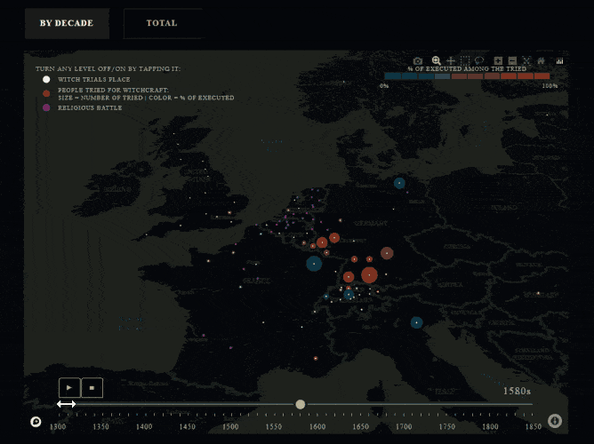
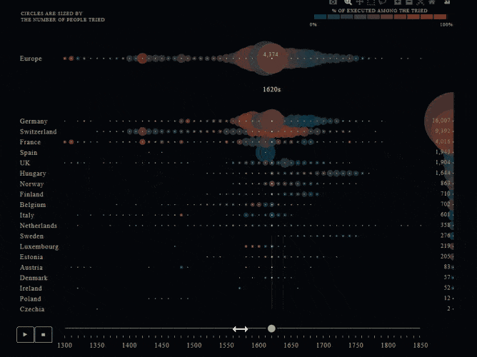
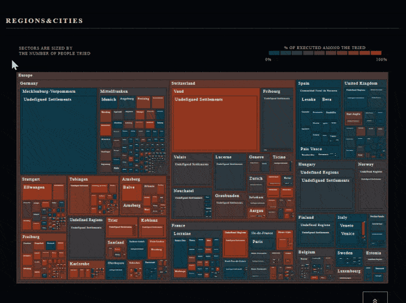
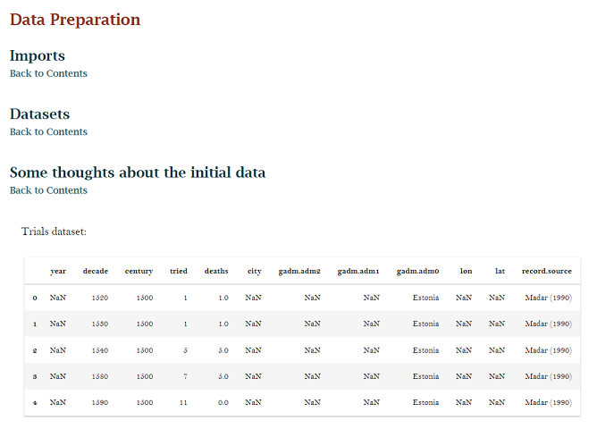
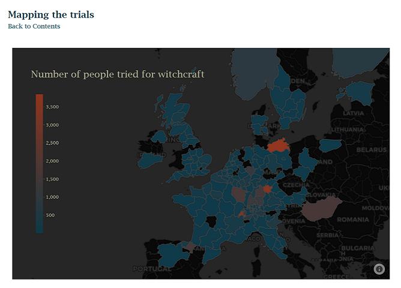
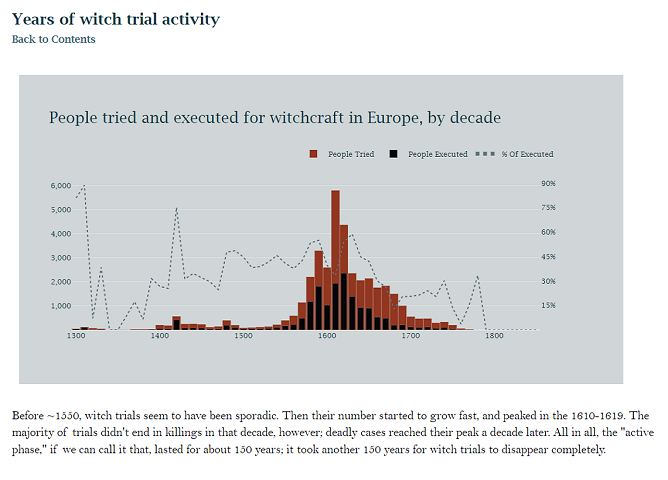

# Dash Plotly Dataviz | European Witch Hunt History Animated

|  |  |  |
| :---:   | :---: | :---: |

## About

This dashboard visualizes the data on witch trials and executions in Europe between 1300 and 1850. It was collected by T. Leeson and Jacob W. Russ for their economic research and can be found on Russ’s [repo](https://github.com/JakeRuss/witch-trials/tree/master/data). 

The researchers' idea was to prove the correlation between the scale of competition between the Catholic and Protestant churches and the surge in witch trials in 1550–1700. Here’s their [paper](https://www.peterleeson.com/Witch_Trials.pdf), and here’s a nice [article](https://qz.com/1183992/why-europe-was-overrun-by-witch-hunts-in-early-modern-history) on the subject. My initial idea was to put the trials on an interactive map. To the map, I added a timeline and a 3-level treemap, as well as some Bootstrap components.

I had to remap the trials according to European NUTS levels to be able to use Eurostat GeoJSON data. The data preparation code can be found [here](https://github.com/lomska/plotly-dash-datavizes-witch-hunt-history/blob/main/app_data_prep.py).

To run the app code locally, a mapbox token is needed.

#### [EXPLORE THE DASHBOARD](http://witchy-years.herokuapp.com/)

## The Notebook

|  |  |  |
| :---:   | :---: | :---: |

The whole pre-processing is explained in the notebook, which also includes data exploration and more visualizations:

#### [WITH ALL THE CODE (NBVIEWER)](https://nbviewer.org/github/lomska/plotly-dash-datavizes-witch-hunt-history/blob/main/Witchy-Years-Notebook.ipynb) 
#### [CODE CELLS EXCLUDED (HTML)](https://github.com/lomska/plotly-dash-datavizes-witch-hunt-history/blob/main/Witchy-Years-Notebook.html)
#### [KAGGLE](https://www.kaggle.com/code/takaya0/european-witch-trials-charted-animated)
